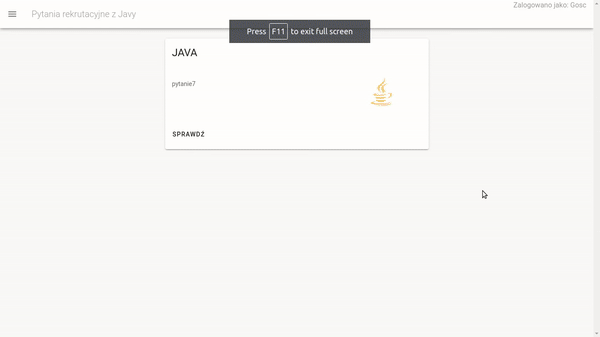

# interview-question

Apke stworzylem na wlasne potrzeby w celu przygotowania sie na rozmowe kwalifikacyjna oraz aby poznac nowe technologie.
Jest to taki tinder z pytaniami rekrutacyjnymi. Backend zrobiony w spring boot, hibernate, front vue.js, vuetify, postgresql.

Aplikacja umozliwia:
- zalogowanie, wylogowanie,
- osobny panel admina a w nim:
  - dodania pytania, 
  - dodanie pytan z pliku csv, 
  - usuniecie pytania, 
- w dashboard mamy tinder z pytaniami, dajemy umiem/nieumiem lub sprawdz, wybrane pytanie trafia do indywidualnego konta uzytkownia,
- uzytkownik posiada swoj panel z podgladem pytan na zywo.

w planach: rejstracja uzytkownikow, logowanie kontem googla, quiz, rozwiniecie panelu uzytkownicy w panel admin, filtrowanie po pytaniach.
